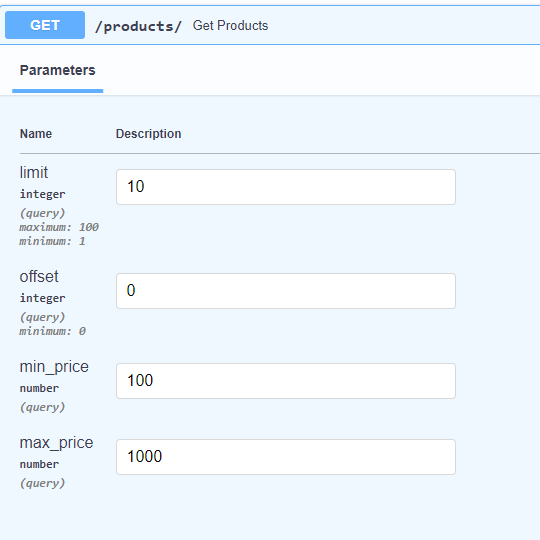
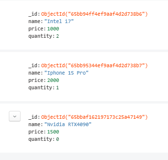
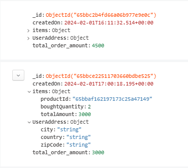

# CosmoCloud FastAPI E-commerce API

This is a CosmoCloud FastAPI Assignment for an e-commerce API with CRUD operations for products and orders. The project uses MongoDB as the database.

### Features

CRUD operations for products
Order creation with validation of available product quantity
Pagination and filtering for products

```
Prerequisites

Before you begin, ensure you have met the following requirements:

Python 3.8 or later installed
MongoDB installed and running

Getting Started
To get a local copy up and running, follow these simple steps.

Installation
Clone the repository:

bash
Copy code
git clone https://github.com/yourusername/fastapi-ecommerce-api.git
Change into the project directory:

bash
Copy code
cd fastapi-ecommerce-api
Create a virtual environment:

bash
Copy code
python -m venv venv
Activate the virtual environment:

On Windows:

bash
Copy code
.\venv\Scripts\activate
On macOS and Linux:

bash
Copy code
source venv/bin/activate
Install dependencies:

bash
Copy code
pip install -r requirements.txt
Configuration
Open the .env file and configure the MongoDB connection URI:

ini
Copy code
MONGODB_URI=mongodb://localhost:27017/your_database_name
Replace your_database_name with the desired database name.

Running the Application
Run the FastAPI application:

bash
Copy code
uvicorn main:app --reload
The application will be accessible at http://127.0.0.1:8000.
```

### API Documentations

POST /orders/

    SCHEMA: {
    "items": {
    "productId": "string",
    "boughtQuantity": 0,
    "totalAmount": 0
        },
    "userAddress": {
    "city": "string",
    "country": "string",
    "zipCode": "string"
        }
    }

GET /products/?limit=10&offset=0&min_price=100&max_price=1000

SCHEMA:



POST /products/

    SCHEMA:
        {
            "name": "string",
            "price": 0,
            "quantity": 0
        }

GET /products/{product_id}

PUT /products/{product_id}

DELETE /products/{product_id}

MongoDB collection Snippet for Product:



MongoDB collection Snippet for Order:



### Usage and Code structure

Visit the FastAPI documentation at http://127.0.0.1:8000/docs to explore and test the API endpoints.

I created the Rest API like structure, organised in MVC fashion to address and keep controller and model seprated.

First we can add the product with the create api from product controller that just take basic information like what is
the product name, price and quatity available.

We can get the output for that product with the get api for all products as well as with pagination and offset

There are also other CRUD based API for product in case we require them.

I have created a create order controller which handles create order api.
The API first check if the productId exist in the product collection and then do some basic checks like checking if we have available quatity to buy.
It will update the price from brought value with the total price amount of the order.

It also updates the left available quantity in the product collection.
